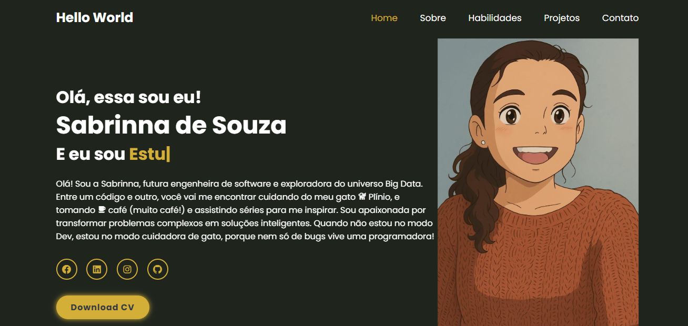

# Meu Portfólio Pessoal - Sabrinna de Souza

> Desenvolvido em **HTML, CSS e JavaScript** com tema **Dourado & Preto**.



---

## Sobre o Projeto
Este é o meu portfólio pessoal, criado para apresentar quem sou, minhas habilidades e projetos.  
Aqui você encontra um pouco da minha trajetória em **Engenharia de Software** e **Big Data**, além de links para entrar em contato comigo.  

---

## Tecnologias Utilizadas
- HTML5  
- CSS3  
- JavaScript (ES6+)  
- [BoxIcons](https://boxicons.com/)  
- [Typed.js](https://github.com/mattboldt/typed.js/)  
- [ScrollReveal](https://scrollrevealjs.org/)  

---

## Demonstração
### Desktop


### Mobile


---

## Como Executar Localmente

Clone este repositório:
```bash
git clone https://github.com/Ssteixeira/portfolio.git
